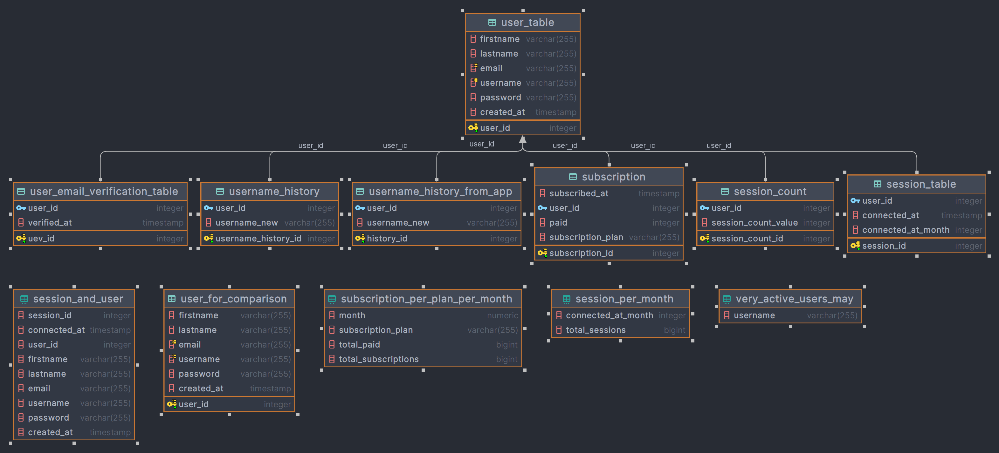

# Documentation du Projet de Base de Données d'Authentification

## Introduction

Ce projet vise à construire une base de données robuste pour un système d'authentification, en se concentrant sur la
création de structures de données appropriées, la gestion des contraintes et l'optimisation des requêtes.

## Structure du Projet

Le projet est divisé en plusieurs parties, chacune se concentrant sur un aspect différent de la base de données :

- [**questions.md**](./questions.md) : Liste des questions à traiter dans le projet.

- [**Partie I : Création de la Base de Données**](#partie-i--création-de-la-base-de-données): Création de la base de
  données `app_auth` et de ses tables principales.
- [**Partie II : Compréhension des Données**](#partie-ii--compréhension-des-données): Exploration approfondie des
  données et création de vues pour analyser les informations des abonnements.
- [**Partie III : Comparaison de Requêtes**](#partie-iii--comparaison-de-requêtes): Comparaison de performances des
  requêtes SQL avant et après l'indexation.
- [**Partie IV : Monitoring**](#partie-iv--monitoring): Mise en place de triggers pour le suivi et l'historisation des
  données.
- [**Partie V : Considérations Applicatives**](#partie-v--considérations-applicatives): Intégration avec MongoDB et
  création de fonctions pour la migration des données.

## Contenu du Projet

### Partie I : Création de la Base de Données

- [**`part_1_1.sql`**](./part_1_1.sql): Création des tables initiales et ajout de contraintes.
- [**`part_1_2.sql`**](./part_1_2.sql): Insertion des données générées avec Python et Faker.
- [**`part_1_3.sql`**](./part_1_3_a.sql): Création de la vue `session_and_user`.
- [**`part_1_3_b.sql`**](./part_1_3_b.sql) & [**`part_1_3_b_view.sql`**](./part_1_3_b_view.sql): Ajout de colonne et
  création de vue pour les sessions par mois.
- [**`part_1_3_c.sql`**](./part_1_3_c.sql): Création de la vue `very_active_users_may`.

### Partie II : Compréhension des Données

- [**`part_2_1.sql`**](./part_2_1.sql): Création de la table `subscription_table` et insertion de données.
- [**`part_2_2.sql`**](./part_2_2.sql): Création de la vue `subscription_per_plan_per_month`.

### Partie III : Comparaison de Requêtes

- [**`part_3.ipynb`**](./part_3.ipynb): Notebook Jupyter pour la comparaison des temps d'exécution des requêtes SQL.

### Partie IV : Monitoring

- [**`part_4_1.sql`**](./part_4_1.sql): Création de la table `session_count` et du
  trigger `trigger_update_session_count`.
- [**`part_4_2.sql`**](./part_4_2.sql): Création de la table `username_history` et du trigger `trigger_update_username`.
- [**`part_4_3.ipynb`**](./part_4_3.ipynb): Notebook Jupyter pour la comparaison des temps d'exécution avec et sans
  trigger.

### Partie V : Considérations Applicatives

- [**`part_5.ipynb`**](./part_5.ipynb): Intégration avec MongoDB, migration des données et analyses supplémentaires.

## Utilisation

Pour utiliser ce projet, veuillez suivre les instructions dans chaque fichier SQL et notebook Jupyter. Assurez-vous
d'avoir les dépendances nécessaires installées et de disposer des accès appropriés aux bases de données PostgreSQL et
MongoDB.

## Schéma de la Base de Données

Vous pouvez retrouver le schéma de la base de données dans le fichier [**`schema.png`**](./media/schema.png).
et ci dessous :

ainsi que la base de données complète dans le fichier [**`Bdd_final.sql`**](./Bdd_final.sql).